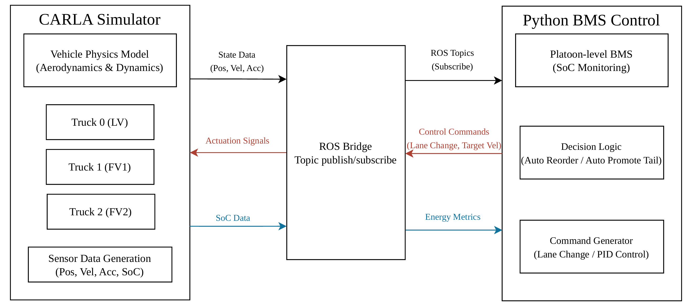
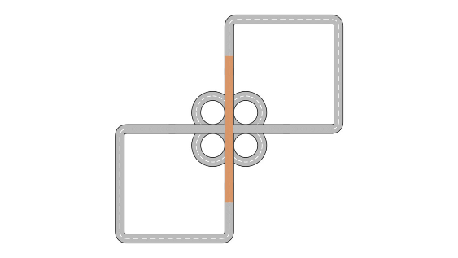
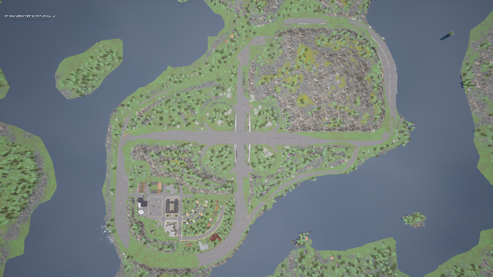
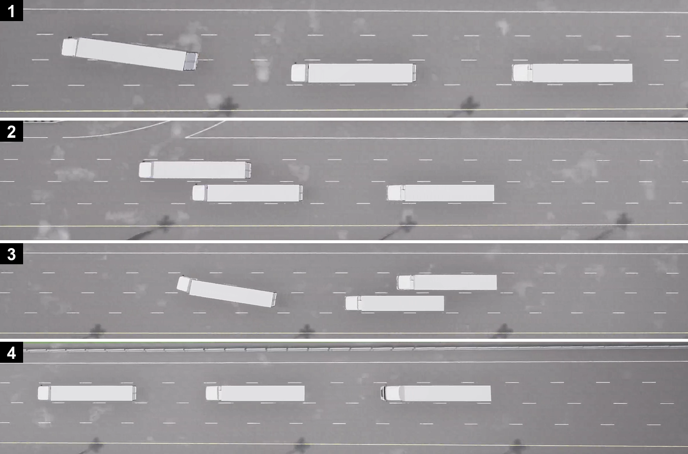
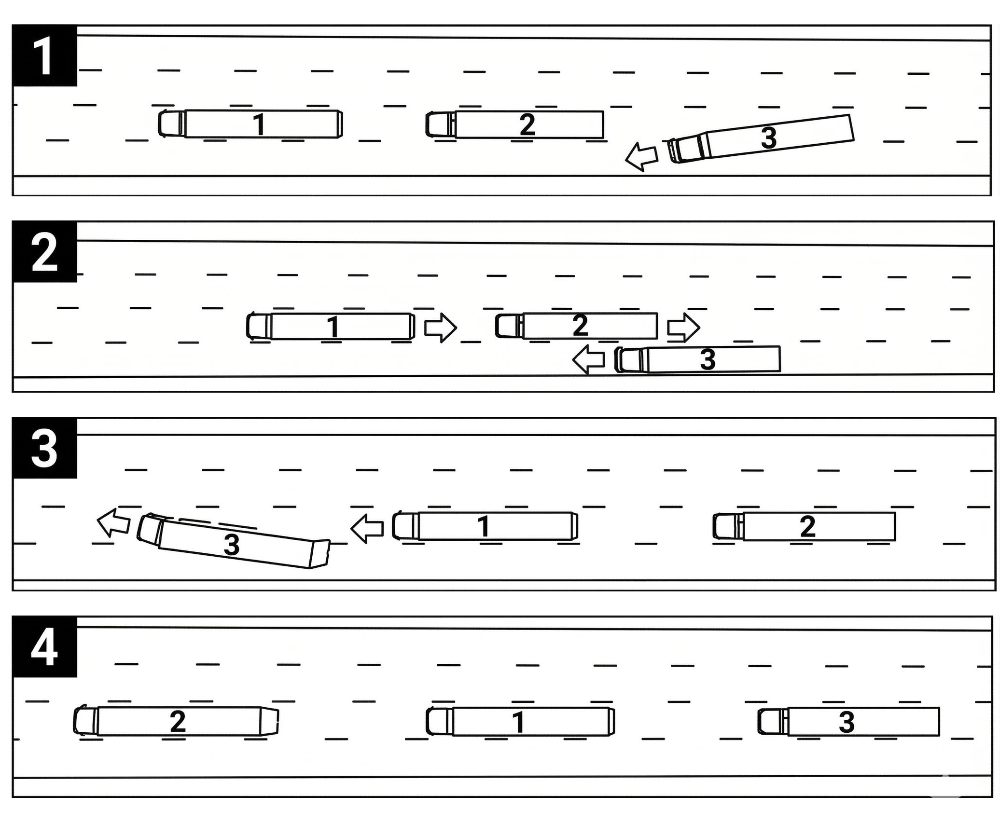
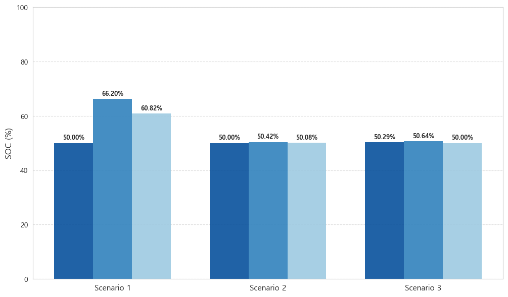
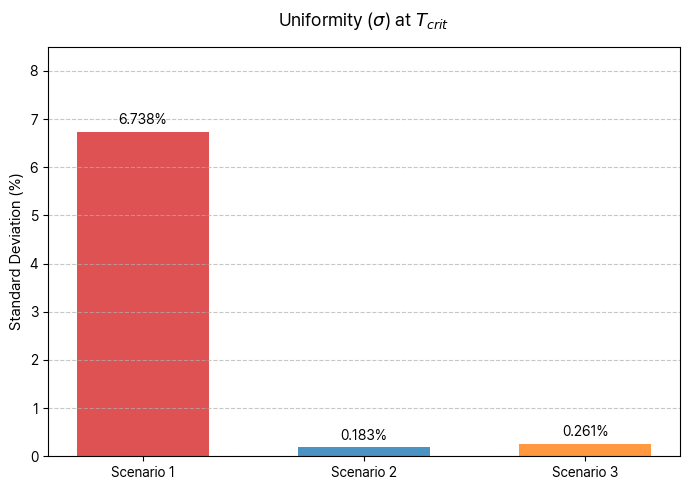
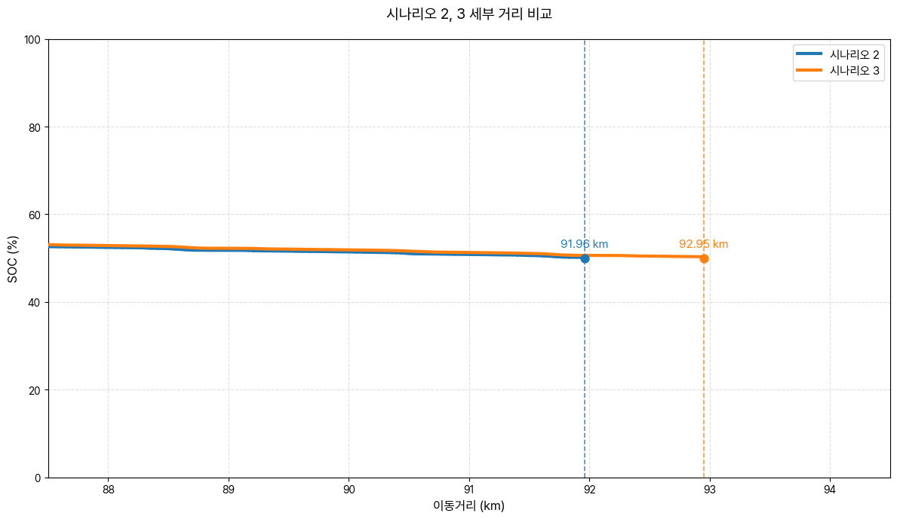
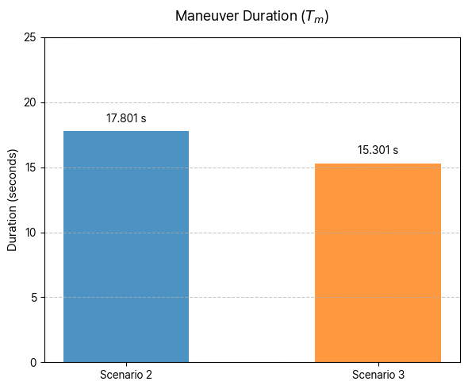

# Truck-Platooning-2

Research code for CARLA + ROS2-based electric truck (e-Truck) platooning.
Covers lane-detection-based autonomous following, dynamic sequence reordering within a platoon (Intra-Platooning Position Change), and energy-efficiency evaluation via a Python-based BMS.

---

## Overview

Platooning is a technology in which multiple vehicles travel at a fixed gap to improve fuel efficiency and traffic throughput. However, situations such as a lead-vehicle swap, energy management, or a fault response require changing a vehicle's position within the platoon, so a strategy for doing this safely and efficiently is needed.

In an electric truck (e-Truck) platoon, the lead vehicle also absorbs the most aerodynamic drag, so its battery (SoC) drains far faster than the following vehicles. If this imbalance isn't resolved, the platoon's operation stops when the lead vehicle's battery is depleted even while the following vehicles still have charge left.

This repository contains the implementation for research addressing both problems above.

1. **Dynamic Sequence Reordering** — using the CARLA simulator, camera-based multi-lane detection (BEV + Sliding Window), and 2D-lidar-based inter-vehicle distance measurement, this implements two scenarios (cyclic reorder / promoting a specific vehicle to the lead) that safely swap a vehicle's position within the platoon
2. **Range-Efficiency Assessment** — a framework that connects ROS Bridge with a Python-based BMS module to quantitatively evaluate how a reordering strategy affects the platoon's average energy efficiency, SoC uniformity, and achievable driving range



*Real-time closed-loop integration structure: CARLA Simulator ↔ ROS Bridge ↔ Python BMS Control*

---

## Features

- 3-truck electric platoon simulation on CARLA (Town04_Opt map)
- Camera BEV transform + Sliding Window multi-lane detection
- 2D-lidar point-cloud-based inter-vehicle distance measurement and longitudinal PID control
- Python-based BMS: SoC estimation, position-based aerodynamic drag correction, real-time energy monitoring (Live Energy Monitor)

<p float="left">
  
  
</p>

*The Town04_Opt map (left) and the driving point selected via a pitch-angle test on its flattest section (right)*

- Platoon reordering modes
  - Mode 1 `Lane Keeping` — basic driving with no position changes
  - Mode 2 `Auto Reorder` — a full reorder where the lead vehicle moves to the rear and the following vehicles each advance one position

    

  - Mode 3 `Auto Promote Tail` — promotes the rearmost vehicle with the highest SoC to the lead

    

### Controls (`platooning_manager`)

| Key | Action |
| --- | --- |
| `t` | Full reorder (via left lane) |
| `y` | Full reorder (via right lane) |
| `j` | Promote the vehicle in position 2 to the lead (left lane) |
| `k` | Promote the vehicle in position 3 to the lead (left lane) |
| `q` / `e` | Truck 0 lane change left / right |
| `a` / `d` | Truck 1 lane change left / right |
| `z` / `c` | Truck 2 lane change left / right |
| `ESC` | Quit |

---

## Repository Structure

```
.
├── truck_control/          # ROS2 (Python) package — lane detection, PID control, energy/SoC monitoring, platoon management
│   ├── truck_control/      # Node implementations
│   └── matlab/             # SoC/energy post-processing and visualization scripts
├── tm_experiment_control/  # ROS2 (Python) package — deterministic scenario runner and experiment automation
├── truck_platooning/       # ROS2 (C++) package — a C++ port of the Python nodes (in progress, partly unfinished)
└── trailer_watcher.py      # Utility script that corrects the trailer-to-truck offset in CARLA
```

**Tech Stack:** CARLA Simulator · ROS2 · ROS Bridge · Python · C++ · MATLAB

---

## Results

The three scenarios (S1: Lane Keeping, S2: Auto Reorder, S3: Auto Promote Tail) were compared up to the point where any truck in the platoon first reached 50% SoC.

<p float="left">
  
  
</p>

- **SoC uniformity**: compared to the fixed platoon (S1, σ 6.738%), S2 reached 0.183% and S3 reached 0.261% — roughly a **37× and 26×** improvement, respectively
- **Achievable driving range**: S1 88.02 km → S2 91.96 km (+4.5%), S3 92.96 km (**+5.6%**)
- **Average energy efficiency (η_avg)**: S1 2,095.9 Wh/km, S2 2,438.6 Wh/km, S3 2,405.6 Wh/km — reordering maneuvers do consume extra energy, but battery balancing extends the platoon's sustainable driving range by more than that cost

<p float="left">
  
  
</p>

Reordering maneuver duration (T_m) was 17.8s for S2 and 15.3s for S3 — promoting the rear vehicle directly to the lead (S3) produced a faster, more efficient maneuver.

---

## Publications

The code in this repository is based on the experimental implementation of the following two papers.

- Yoonjin Cho, Daeho Won, Jeongyun Choi, Jong-Chan Kim, **"Dynamic Sequence Reordering for Truck Platooning,"** *The Korean Society of Automotive Engineers (KSAE), Autumn Conference*, 2025.
- Yoonjin Cho, Daeho Won, Jeongyun Choi, Jong-Chan Kim, **"Range-Efficiency Assessment Method for Dynamic e-Truck Platoon,"** *Korean Society of Automotive Engineers (KSAE)*, 2026.

---

## Contributors

- [Yoonjin Cho](https://github.com/gerrard088)
- [Daeho Won](https://github.com/1daymore)
- [Jeongyun Choi](https://github.com/choijeongyun12)
